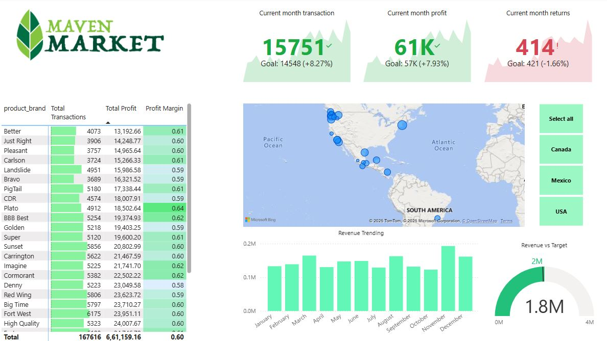

DashBoard 1 -  AdventureWorks Power BI Dashboard

This Power BI dashboard provides an interactive analysis of Adventure Works, a fictional retail and manufacturing company. The dashboard enables business users to gain insights into sales performance, customer demographics, and product trends through dynamic visualizations and key metrics.

📈 Key Insights
✅ Sales Performance – Revenue trends, regional sales distribution, and year-over-year growth.
✅ Customer Analysis – Customer segmentation by demographics and purchasing behavior.
✅ Product Performance – Best-selling products, category-wise sales, and profit margins.
✅ Order Trends – Monthly and quarterly sales trends, order volume, and market performance.

🔧 Tools & Technologies
Power BI Desktop
DAX (Data Analysis Expressions)
Power Query and MS Excel for data transformation 

Dashboard 2 - Maven Market Power BI Dashboard

This Power BI dashboard provides an in-depth analysis of Maven Market, a retail and e-commerce business. It helps track sales trends, customer purchasing behavior, and product performance to support data-driven decision-making.

📈 Key Insights
✅ Sales Performance – Revenue trends, regional sales distribution, and year-over-year growth.
✅ Customer Behavior – Customer segmentation, purchase frequency, and average order value.
✅ Product Insights – Best-selling products, category-wise sales, and profitability analysis.
✅ Market Trends – Seasonal trends, demand forecasting, and marketing impact.

🔧 Tools & Technologies
Power BI Desktop
DAX (Data Analysis Expressions)
Power Query and MS Excel for data transformation 
