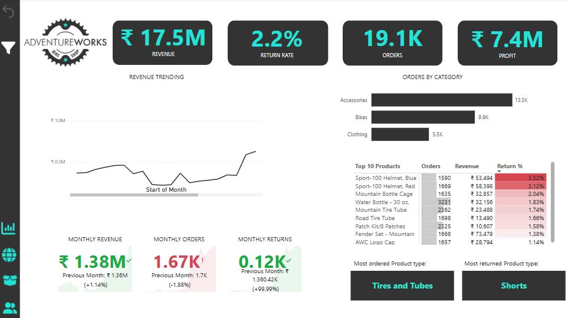
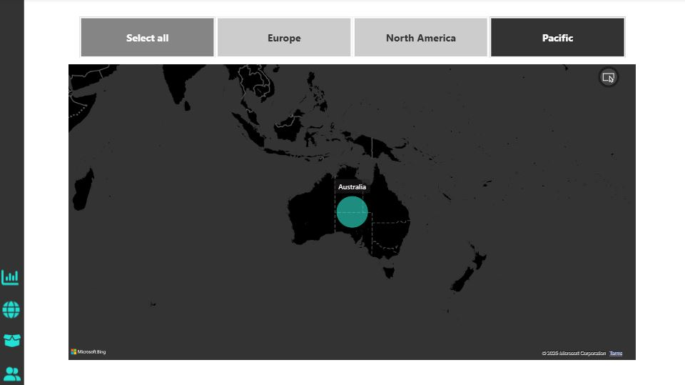
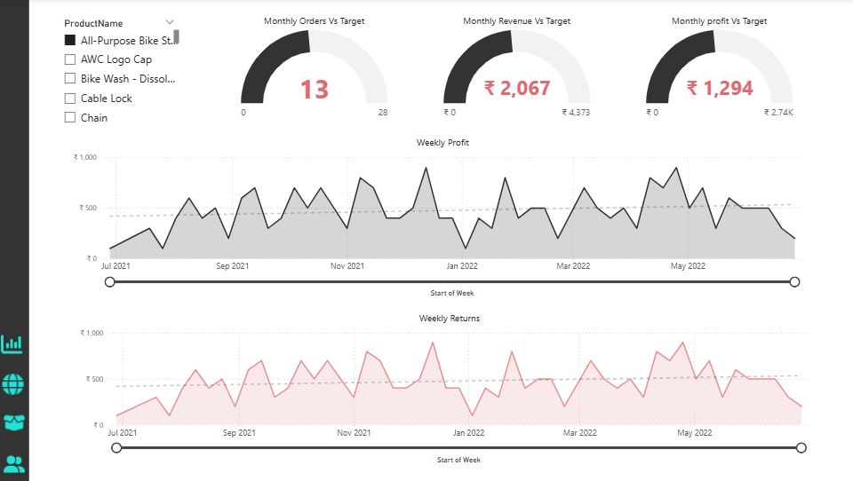
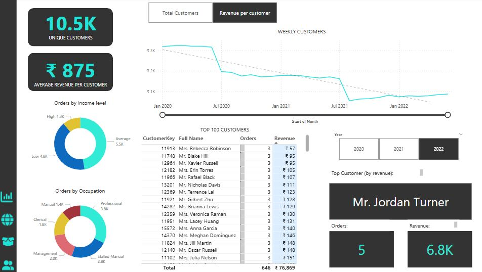
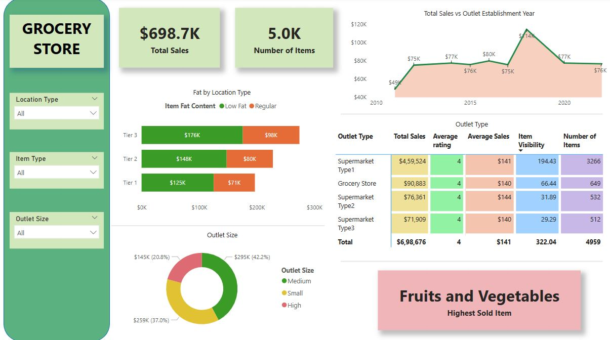

**DashBoard 1** -  AdventureWorks Power BI Dashboard

This Power BI dashboard provides a detailed analysis of Adventure Works' sales performance. It highlights key metrics such as revenue trends, product performance, regional sales distribution, and customer purchasing patterns.

**Description**

Sales Performance – Revenue trends, regional sales distribution, and year-over-year growth.

Customer Analysis – Customer segmentation by demographics and purchasing behavior.

Product Performance – Best-selling products, category-wise sales, and profit margins.

Order Trends – Monthly and quarterly sales trends, order volume, and market performance.

**Dashboard Features**

Interactive Visualizations: Explore sales trends using dynamic charts and graphs.

Advanced Filtering Options: Customize views by filtering based on product categories, customer segments, and time periods.

Key Performance Metrics: Track revenue, profit margins, and high-performing products.

Geospatial Insights: Analyze sales distribution across different regions.

User-Friendly Interface: Designed for intuitive navigation and insightful data exploration.

**Tools & Technologies**

Power BI Desktop

DAX (Data Analysis Expressions)

Power Query and MS Excel for data transformation 

**DashBoard 2** - Grocery Store Power BI DashBoard

This Power BI dashboard provides an in-depth analysis of grocery store sales performance. It offers insights into key metrics such as revenue trends, product category performance, customer purchasing patterns, and external factors influencing sales.

**Description**

Store Details: Sales data for different grocery store locations.

Product Categories: Performance of various product categories.

Customer Behavior: Purchasing patterns and trends over time.

External Factors: Impact of economic indicators like inflation, seasonal trends, and pricing.

**Dashboard Features**

Interactive Data Visualizations: Dynamic charts and graphs to explore grocery sales trends.

Filtering Options: Refine data views by filtering based on product categories, regions, and time periods.

User-Friendly Interface: Designed for seamless navigation and enhanced data exploration.

**Technologies Used**

Power BI Desktop for data visualization

DAX (Data Analysis Expressions) for calculated measures

Power Query and MS Excel for data transformation

